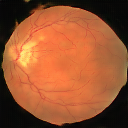
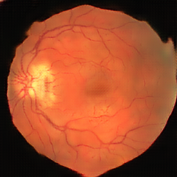

# Pix2Pix - Image-to-Image Translation

# Results 

## Table of Contents

- [Introduction](#introduction)
- [Features](#features)
- [Requirements](#requirements)
- [Installation](#installation)
- [Usage](#usage)
- [Contributing](#contributing)

## Introduction

Pix2Pix is a powerful image-to-image translation model that uses deep learning techniques to transform one type of image into another. This project aims to provide an easy-to-use implementation of the Pix2Pix algorithm for medical image generation.

## Features

- High-quality image translation
- Support for custom datasets
- User-friendly interface
- Pre-trained models available

## Requirements

- Python  3.6+
- Pytorch 1.8.2+

## Installation

To get started with Pix2Pix, follow these steps:

1. Clone the repository: `git clone https://github.com/capnmav77/Pix2Pix.git`
2. Navigate to the project directory: `cd Pix2Pix`
3. Install the required dependencies: `pip install -r requirements.txt`

## Usage

After installation, you can navigate to train.py and run the script in order to start training .

## Contributing

Contributions to this repository are welcome! If you find bugs or have suggestions for improvements, please feel free to submit an issue or a pull request. Before contributing, please read our contribution guidelines.

